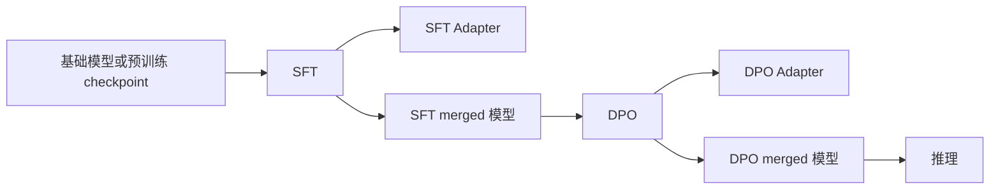

# 后训练模块成果记录

> 记录日期：2026-07-22
>
> 当前状态：已完成首个可运行版本，支持 SFT、DPO、LoRA、全参数训练和模型推理。

## 1. 建设目标

本次工作的目标是在预训练模块尚未完成的情况下，先建立一套独立、可运行、可验证的后训练链路。模块采用 Hugging Face 技术栈：

- TRL：提供 `SFTTrainer`、`DPOTrainer` 以及对应的训练参数对象。
- PEFT：提供 LoRA 参数高效微调，并支持训练后合并权重。
- Accelerate：负责 CPU、单 GPU 和后续分布式训练的进程启动与设备管理。
- Hydra：统一管理阶段、模型、数据、PEFT 和训练参数。

当前后训练模块不依赖仓库内尚未完成的预训练训练循环。二者之间只通过 Hugging Face 格式的模型目录或 checkpoint 路径连接，因此可以先独立开发和验证，待预训练模型可用后再直接接入。

## 2. 已实现能力

| 能力 | 状态 | 说明 |
| --- | --- | --- |
| SFT 监督微调 | 已完成 | 使用 TRL `SFTTrainer`，支持多种 JSONL 数据格式 |
| DPO 偏好优化 | 已完成 | 使用 TRL `DPOTrainer`，支持显式偏好三元组 |
| LoRA 微调 | 已完成 | 默认启用，可通过 Hydra 切换为全参数训练 |
| Adapter 保存 | 已完成 | LoRA 训练结果保存在阶段输出目录 |
| LoRA 权重合并 | 已完成 | 默认在输出目录的 `merged/` 下生成完整模型 |
| 断点续训 | 已完成 | 通过 `resume_from_checkpoint` 传递给 TRL |
| CPU / 单 GPU 启动 | 已完成 | 提供两份 Accelerate 配置 |
| 合并模型推理 | 已完成 | 可直接加载 `merged/` 模型目录 |
| Base + Adapter 推理 | 已完成 | 可分别指定基础模型和 Adapter 路径 |
| 数据入口校验 | 已完成 | 检查文件、JSON、必需字段并报告文件名和行号 |

## 3. 模块边界与执行流程



模块采用独立入口，不修改已有预训练核心文件：

- 训练入口：`scripts/post_train.py`
- 推理入口：`scripts/post_inference.py`
- 后训练包：`src/python_starter/post_training/`
- 总配置：`configs/post_training.yaml`
- 阶段配置：`configs/post_training/`
- PEFT 配置：`configs/peft/`
- Accelerate 配置：`configs/accelerate/`
- 测试：`tests/test_post_training.py`

## 4. 依赖与环境

后训练依赖以可选依赖组的形式定义在 `pyproject.toml` 中：

```toml
[project.optional-dependencies]
post-training = [
    "trl>=1.8.0,<2.0.0",
    "peft>=0.19.0,<1.0.0",
]
```

Accelerate 和 Transformers 仍属于项目基础依赖。当前 `uv.lock` 和本地验证环境中的主要版本如下：

| 依赖 | 当前锁定/安装版本 |
| --- | --- |
| TRL | 1.8.0 |
| PEFT | 0.19.1 |
| Accelerate | 1.14.0 |
| Transformers | 5.14.1 |
| Hydra Core | 1.3.4 |

安装运行依赖：

```bash
uv sync --extra post-training
```

需要同时运行测试和质量检查时：

```bash
uv sync --extra dev --extra post-training
```

PyTorch CUDA 12.4 软件源只对 Linux x86_64 环境生效，避免 macOS 环境错误地解析 CUDA wheel。

## 5. 数据格式

训练数据使用 UTF-8 编码的 JSONL 文件，每行一个 JSON 对象。空行会被忽略；空文件、非法 JSON、非对象数据和字段缺失会在训练启动前报错。

### 5.1 SFT 数据

SFT 支持以下三类格式。

`prompt + response`：加载时会把 `response` 规范化为 `completion`。

```json
{"prompt":"请解释什么是梯度下降。","response":"梯度下降是一种迭代优化算法……"}
```

`prompt + completion`：

```json
{"prompt":"请解释什么是梯度下降。","completion":"梯度下降是一种迭代优化算法……"}
```

对话消息格式：

```json
{"messages":[{"role":"user","content":"你好"},{"role":"assistant","content":"你好，有什么可以帮助你？"}]}
```

也可以使用已经拼接好的 `text` 字段：

```json
{"text":"用户：你好\n助手：你好，有什么可以帮助你？"}
```

### 5.2 DPO 数据

DPO 当前要求显式提供 `prompt`、`chosen` 和 `rejected`：

```json
{"prompt":"介绍一下北京。","chosen":"北京是中国的首都……","rejected":"北京是一种食物。"}
```

字段含义：

- `prompt`：模型输入。
- `chosen`：偏好数据中质量更高的回答。
- `rejected`：偏好数据中质量更低的回答。

## 6. 配置说明

### 6.1 总配置

`configs/post_training.yaml` 默认组合：

```yaml
defaults:
  - post_training: sft
  - peft: lora
  - _self_
```

必须在命令行或新配置中提供：

```yaml
model:
  name_or_path: /path/to/model

data:
  train_path: /path/to/train.jsonl
```

常用可选项：

| 配置 | 默认值 | 作用 |
| --- | --- | --- |
| `model.tokenizer_name_or_path` | 与模型路径一致 | 单独指定 tokenizer |
| `model.ref_model_name_or_path` | `null` | 为 DPO 显式指定参考模型 |
| `model.trust_remote_code` | `false` | 是否允许加载远程自定义代码 |
| `data.eval_path` | `null` | 可选验证集路径 |
| `artifacts.save_merged_model` | `true` | LoRA 训练后是否生成完整模型 |
| `artifacts.merged_subdir` | `merged` | 完整模型子目录名 |
| `seed` | `42` | 全局随机种子 |

### 6.2 LoRA 配置

默认 `configs/peft/lora.yaml`：

```yaml
enabled: true
r: 16
lora_alpha: 32
lora_dropout: 0.05
bias: none
task_type: CAUSAL_LM
target_modules: all-linear
```

如需全参数训练，在命令中加入：

```bash
peft=full
```

全参数训练会把完整模型直接保存到 `output_dir`，不会额外生成 LoRA Adapter，也不需要执行权重合并。

## 7. 运行方法

所有命令均在仓库根目录执行。

### 7.1 CPU SFT 冒烟测试

```bash
uv run --extra post-training accelerate launch \
  --config_file configs/accelerate/cpu.yaml \
  --num_cpu_threads_per_process 8 \
  scripts/post_train.py \
  model.name_or_path=/path/to/base-model \
  data.train_path=/path/to/sft.jsonl \
  +post_training.max_steps=1 \
  post_training.save_strategy=no
```

### 7.2 单 GPU SFT

```bash
uv run --extra post-training accelerate launch \
  --config_file configs/accelerate/single_gpu.yaml \
  scripts/post_train.py \
  model.name_or_path=/path/to/base-model \
  data.train_path=/path/to/sft.jsonl
```

默认输出：

```text
models/checkpoints/post_training/sft/
├── adapter_config.json
├── adapter_model.safetensors
├── tokenizer files
└── merged/
    ├── config.json
    ├── model.safetensors
    └── tokenizer files
```

具体文件会随模型架构、Transformers 和 PEFT 版本略有不同，但 Adapter 位于阶段输出目录、完整模型位于 `merged/` 的目录约定保持不变。

### 7.3 单 GPU DPO

DPO 推荐使用 SFT 阶段生成的完整模型作为策略模型：

```bash
uv run --extra post-training accelerate launch \
  --config_file configs/accelerate/single_gpu.yaml \
  scripts/post_train.py \
  post_training=dpo \
  model.name_or_path=models/checkpoints/post_training/sft/merged \
  data.train_path=/path/to/dpo.jsonl
```

如需显式参考模型：

```bash
model.ref_model_name_or_path=/path/to/reference-model
```

未配置该项时，向 `DPOTrainer` 传入 `ref_model=None`，由 TRL 按当前训练模式处理默认参考模型。

### 7.4 使用验证集

默认配置不执行评估。提供验证集时，需要同时开启评估策略：

```bash
data.eval_path=/path/to/eval.jsonl \
post_training.eval_strategy=epoch
```

### 7.5 断点续训

```bash
post_training.resume_from_checkpoint=/path/to/checkpoint
```

### 7.6 推理

直接加载合并后的完整模型：

```bash
uv run --extra post-training python scripts/post_inference.py \
  --model models/checkpoints/post_training/dpo/merged \
  --prompt "你好，请介绍一下自己" \
  --device auto
```

加载基础模型和独立 Adapter：

```bash
uv run --extra post-training python scripts/post_inference.py \
  --model /path/to/base-model \
  --adapter models/checkpoints/post_training/sft \
  --prompt "你好，请介绍一下自己" \
  --device auto
```

推理入口仅解码 prompt 之后新增的 token，不会把输入 prompt 重复打印到结果中。

## 8. 验证结果

当前版本完成了以下验证：

| 检查项 | 结果 |
| --- | --- |
| 后训练模块单元测试 | 19 个测试全部通过 |
| 后训练包分支覆盖率 | 82.41%，超过仓库 80% 阈值 |
| 后训练相关 Ruff 检查 | 通过 |
| 后训练相关 mypy 严格检查 | 通过 |
| Hydra 训练与推理入口帮助信息 | 通过 |
| CPU Accelerate 配置 | 通过 |
| 单 GPU Accelerate 配置解析 | 通过 |
| `uv lock --check` | 通过 |
| wheel 与源码包构建 | 通过 |
| wheel 内容检查 | 包含完整 `python_starter.post_training` 包 |
| 本地微型模型端到端冒烟测试 | SFT → 合并 → DPO → 合并 → 推理通过 |

对应的模块测试命令：

```bash
.venv/bin/pytest -o addopts= tests/test_post_training.py \
  --cov=src/python_starter/post_training \
  --cov-report=term-missing \
  --cov-branch \
  --cov-fail-under=80
```

质量检查命令：

```bash
.venv/bin/ruff check \
  src/python_starter/post_training \
  scripts/post_train.py \
  scripts/post_inference.py \
  tests/test_post_training.py

.venv/bin/mypy \
  src/python_starter/post_training \
  scripts/post_train.py \
  scripts/post_inference.py \
  tests/test_post_training.py
```

## 9. 当前限制与已知问题

### 9.1 预训练模型尚未接入

当前后训练模块已经能够接收任意兼容 Hugging Face `AutoModelForCausalLM` 的模型目录，但仓库自身的预训练模块还没有产出可直接接入的模型。后续只需让预训练阶段保存标准 Transformers 模型和 tokenizer，即可把该目录传给 `model.name_or_path`。

### 9.2 仓库全量测试仍被已有问题阻塞

执行全量 `pytest` 时，现有 `src/python_starter/core/trainer.py` 从 `python_starter.core.utils` 导入了不存在的 `get_logger`，导致 `tests/test_trainer.py` 在收集阶段失败。实际日志函数位于 `python_starter.infrastructure.logging`。

该问题属于原有预训练核心代码，不是后训练模块引入。为了维持模块隔离，本次没有修改预训练实现。

### 9.3 当前只覆盖 SFT 和 DPO

首个成品版本暂未加入 PPO、GRPO、奖励模型训练和在线 RL。当前优先保证离线数据下的 SFT → DPO → 推理链路完整可用。

### 9.4 尚未完成真实大模型训练基准

目前端到端测试使用本地微型模型，验证的是代码路径、配置、保存、合并和加载流程。显存占用、吞吐量、收敛质量和大模型超参数仍需在目标模型与正式数据集上验证。

## 10. 后续建议

建议按照以下顺序继续建设：

1. 修复预训练模块的日志导入问题，并使其能够保存标准 Hugging Face checkpoint。
2. 使用目标基础模型和一小批真实 SFT 数据完成单 GPU 训练基准。
3. 建立 SFT 和 DPO 数据预处理脚本，增加字段内容与对话角色校验。
4. 补充训练指标、显存峰值、耗时和 checkpoint 信息记录。
5. 增加多 GPU Accelerate 或 DeepSpeed 配置。
6. 在 SFT、DPO 质量稳定后，再评估奖励模型、GRPO 等扩展阶段。

## 11. 验收结论

后训练模块已经形成可独立运行的最小成品：它能读取并校验 SFT/DPO 数据，按 Hydra 配置创建 TRL Trainer，通过 PEFT 执行 LoRA 训练，保存 Adapter 和合并后的完整模型，并使用独立推理入口重新加载模型生成回答。

当前唯一尚未建立的项目内链路是“仓库预训练模型 → 后训练模型”，原因是预训练模块本身还没有提供标准 checkpoint。后训练模块的接口已经预留完成，后续不需要重写训练框架，只需传入模型目录即可联通。
